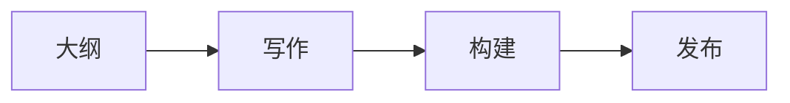

# Plume 组件与 Markdown 选型

项目在 `docs/.vuepress/config.ts` 中启用了 timeline、annotation、Bilibili、YouTube、Mermaid、PDF、PlantUML 和增强表格；主题还支持容器、steps、tabs、code-tabs、file-tree 与 card。项目版本为 `vuepress-theme-plume@1.0.0-rc.203`，使用未列出的语法前必须核对安装版本并构建验证。

官方入口：

- https://theme-plume.vuejs.press/guide/intro/
- https://theme-plume.vuejs.press/guide/collection/
- https://theme-plume.vuejs.press/guide/markdown/extensions/

## 选择原则

| 目的 | 组件 | 不要用于 |
|---|---|---|
| 简短提示、风险、补充信息 | `tip` / `warning` / `danger` / `details` | 包裹普通正文 |
| 有严格先后顺序的操作 | `steps` | 无顺序的特性列表 |
| 同一主题的环境/方案切换 | `tabs` | 连续章节 |
| 同一功能的多语言代码 | `code-tabs` | 单个代码块 |
| 展示目录结构 | `file-tree` | 普通项目符号列表 |
| 并列方案或概念摘要 | `card-grid` | 长篇正文 |
| 事件或版本演进 | `timeline` | 普通步骤 |
| 流程、状态、依赖关系 | Mermaid | 简单两三项列表 |
| UML 类图、时序图等 | PlantUML | Mermaid 已能清晰表达的简单流程 |
| 视频/PDF 是正文必要素材 | 嵌入组件 | 仅作为参考链接的资源 |
| 术语的就地补充解释 | annotation | 长篇脚注或主要论证 |

一篇普通文章通常只需要 1–3 类增强组件。不要为了“看起来丰富”同时堆叠所有组件。

## 提示容器

```markdown
::: tip 提示
这里放能帮助读者完成操作的信息。
:::

::: warning 注意
这里放可能导致失败或数据损失的条件。
:::

::: details 展开查看完整配置
这里放较长但非主线的信息。
:::
```

嵌套容器时，外层使用更多冒号。

## 步骤

```markdown
:::: steps
1. 安装依赖

   ```bash
   corepack pnpm install
   ```

2. 构建站点

   ```bash
   corepack pnpm docs:build
   ```

3. 检查输出目录
::::
```

## Tabs 与 Code Tabs

```markdown
::: tabs
@tab macOS

执行 macOS 命令。

@tab Windows

执行 Windows 命令。
:::
```

````markdown
::: code-tabs
@tab JavaScript

```js
console.log('hello')
```

@tab Python

```py
print('hello')
```
:::
````

需要默认标签时使用 `@tab:active 标题`。

## 文件树

```markdown
::: file-tree
- docs
  - blog
    - example.md
  - .vuepress
    - collections
      - index.ts
:::
```

## 卡片

```markdown
:::: card-grid
::: card title="方案 A" icon="mdi:lightbulb-outline"

适用场景与核心特点。
:::

::: card title="方案 B" icon="mdi:tools"

适用场景与核心特点。
:::
::::
```

图标优先使用项目已有的 Iconify 名称；不确定时省略 `icon`。

## 时间线

```markdown
::: timeline card
- 设计
  time=第一阶段 type=info

  明确目标与边界。

- 实现
  time=第二阶段 type=tip

  完成内容与页面集成。

- 发布
  time=第三阶段 type=success

  构建、推送并验证。
:::
```

列表项的配置行和正文缩进必须正确。

## Annotation

```markdown
站点由 VuePress [+vuepress] 驱动。

[+vuepress]:
  VuePress 是面向内容的静态站点生成器。
```

`[+label]` 左侧保留空格，定义区可以放在段落后或文末。

## Mermaid

````markdown

````

适合流程图、状态图、关系图和简单时序图。节点文字含特殊标点时使用引号。

## PlantUML

```markdown
@startuml
actor User
User -> Blog: 提交大纲
Blog --> User: 返回已发布页面
@enduml
```

适合类图、组件图、部署图和严格 UML 表达。

## 媒体嵌入

```markdown
@[bilibili](BV号)

@[youtube](视频ID)

@[pdf](https://example.com/document.pdf)
```

只填平台 ID，不要把完整 Bilibili/YouTube 页面 URL 放进括号。PDF 可以使用外部 URL 或站点 public 下的绝对路径。

## 项目中可复用的 Vue 组件

现有页面已经使用 `<Badge>`、`<CardGrid>`、`<LinkCard>` 等组件。复用前先搜索项目中的真实示例，保持属性名和闭合方式一致。自定义组件位于 `docs/.vuepress/theme/components/`；除非任务明确需要，不要为了单篇文章修改全局组件或 CSS。

## 官方细分文档

- 容器：https://theme-plume.vuejs.press/guide/markdown/container/
- Steps：https://theme-plume.vuejs.press/guide/markdown/steps/
- Tabs：https://theme-plume.vuejs.press/guide/markdown/tabs/
- Code Tabs：https://theme-plume.vuejs.press/guide/code/code-tabs/
- File Tree：https://theme-plume.vuejs.press/guide/markdown/file-tree/
- Card：https://theme-plume.vuejs.press/guide/markdown/card/
- Timeline：https://theme-plume.vuejs.press/guide/markdown/timeline/
- Annotation：https://theme-plume.vuejs.press/guide/markdown/annotation/
- Mermaid：https://theme-plume.vuejs.press/guide/chart/mermaid/
- PlantUML：https://theme-plume.vuejs.press/guide/chart/plantuml/
- Bilibili：https://theme-plume.vuejs.press/guide/embed/bilibili/
- YouTube：https://theme-plume.vuejs.press/guide/embed/youtube/
- PDF：https://theme-plume.vuejs.press/guide/embed/pdf/
