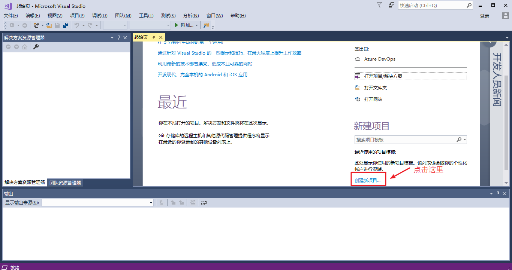
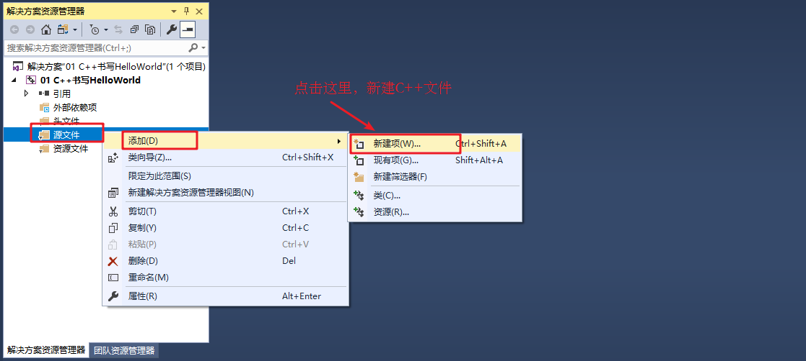

## 1.1  第一个C++程序

编写一个C++程序总共分为4个步骤

* 创建项目
* 创建文件
* 编写代码
* 运行程序

### 1.1.1 创建项目

​	Visual Studio是我们用来编写C++程序的主要工具，我们先将它打开




### 1.1.2 创建文件

右键源文件，选择添加->新建项



给C++文件起个名称，然后点击添加即可。


### 1.1.3 编写代码

```c++
#include<iostream>
using namespace std;

int main() {

    cout << "Hello world" << endl;

    system("pause");

    return 0;
}
```

### 1.1.4 运行程序


## 1.2 注释

**作用**：在代码中加一些说明和解释，方便自己或其他程序员程序员阅读代码

**两种格式**

1. **单行注释**：`// 描述信息` 
   - 通常放在一行代码的上方，或者一条语句的末尾，==对该行代码说明==
2. **多行注释**： `/* 描述信息 */`
   - 通常放在一段代码的上方，==对该段代码做整体说明==

> 提示：编译器在编译代码时，会忽略注释的内容


## 1.3 变量

**作用**：给一段指定的内存空间起名，方便操作这段内存

**语法**：`数据类型 变量名 = 初始值;`

**示例：**

```C++
#include<iostream>
using namespace std;

int main() {

    //变量的定义
    //语法：数据类型  变量名 = 初始值

    int a = 10;

    cout << "a = " << a << endl;
    
    system("pause");

    return 0;
}
```

> 注意：C++在创建变量时，必须给变量一个初始值，否则会报错


## 1.4  常量

**作用**：用于记录程序中不可更改的数据

C++定义常量两种方式

1. **\#define** 宏常量： `#define 常量名 常量值`
   * ==通常在文件上方定义==，表示一个常量


2. **const**修饰的变量 `const 数据类型 常量名 = 常量值`
   * ==通常在变量定义前加关键字const==，修饰该变量为常量，不可修改


**示例：**

```C++
//1、宏常量
#define day 7

int main() {

    cout << "一周里总共有 " << day << " 天" << endl;
    //day = 8;  //报错，宏常量不可以修改

    //2、const修饰变量
    const int month = 12;
    cout << "一年里总共有 " << month << " 个月份" << endl;
    //month = 24; //报错，常量是不可以修改的
    
    
    system("pause");

    return 0;
}
```

## 1.5 关键字

**作用：**关键字是C++中预先保留的单词（标识符）

* **在定义变量或者常量时候，不要用关键字**

C++关键字如下：

| asm        | do           | if               | return      | typedef  |
| ---------- | ------------ | ---------------- | ----------- | -------- |
| auto       | double       | inline           | short       | typeid   |
| bool       | dynamic_cast | int              | signed      | typename |
| break      | else         | long             | sizeof      | union    |
| case       | enum         | mutable          | static      | unsigned |
| catch      | explicit     | namespace        | static_cast | using    |
| char       | export       | new              | struct      | virtual  |
| class      | extern       | operator         | switch      | void     |
| const      | false        | private          | template    | volatile |
| const_cast | float        | protected        | this        | wchar_t  |
| continue   | for          | public           | throw       | while    |
| default    | friend       | register         | true        |          |
| delete     | goto         | reinterpret_cast | try         |          |

`提示：在给变量或者常量起名称时候，不要用C++得关键字，否则会产生歧义。`


## 1.6 标识符命名规则

**作用**：C++规定给标识符（变量、常量）命名时，有一套自己的规则

* 标识符不能是关键字
* 标识符只能由字母、数字、下划线组成
* 第一个字符必须为字母或下划线
* 标识符中字母区分大小写

> 建议：给标识符命名时，争取做到见名知意的效果，方便自己和他人的阅读
