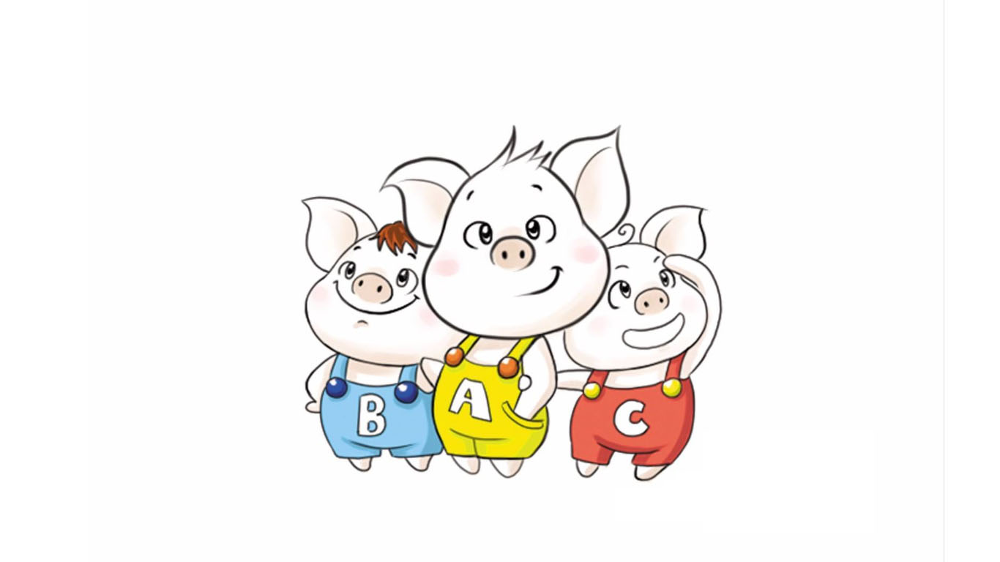
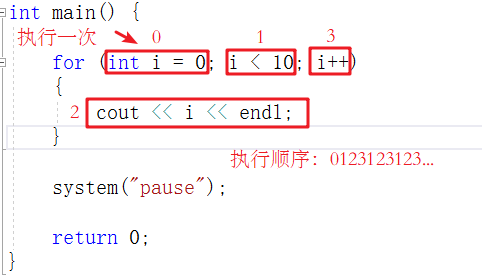
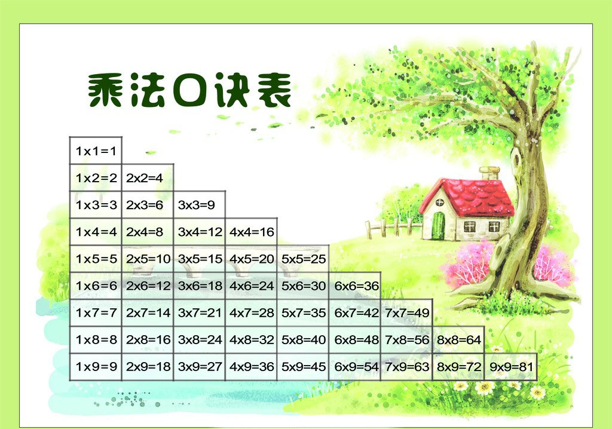

C/C++支持最基本的三种程序运行结构：==顺序结构、选择结构、循环结构==

* 顺序结构：程序按顺序执行，不发生跳转
* 选择结构：依据条件是否满足，有选择的执行相应功能
* 循环结构：依据条件是否满足，循环多次执行某段代码

## 4.1 选择结构

### 4.1.1 if语句

**作用：** 执行满足条件的语句

if语句的三种形式

* 单行格式if语句

* 多行格式if语句

* 多条件的if语句


1. 单行格式if语句：`if(条件){ 条件满足执行的语句 }`

   

   示例：

   ```C++
   int main() {

   	//选择结构-单行if语句
   	//输入一个分数，如果分数大于600分，视为考上一本大学，并在屏幕上打印

   	int score = 0;
   	cout << "请输入一个分数：" << endl;
   	cin >> score;

   	cout << "您输入的分数为： " << score << endl;

   	//if语句
   	//注意事项，在if判断语句后面，不要加分号
   	if (score > 600)
   	{
   		cout << "我考上了一本大学！！！" << endl;
   	}

   	system("pause");

   	return 0;
   }
   ```

    ​输出：
    ```bash
    请输入一个分数：
    700
    您输入的分数为： 700  
    我考上了一本大学！！！
    ```

> 注意：if条件表达式后不要加分号

1. 多行格式if语句：`if(条件){ 条件满足执行的语句 }else{ 条件不满足执行的语句 };`


示例：

```C++
int main() {

	int score = 0;

	cout << "请输入考试分数：" << endl;

	cin >> score;

	if (score > 600)
	{
		cout << "我考上了一本大学" << endl;
	}
	else
	{
		cout << "我未考上一本大学" << endl;
	}

	system("pause");

	return 0;
}
```

​输出：
```bash
请输入一个分数：
700
我考上了一本大学
```

1. 多条件的if语句：`if(条件1){ 条件1满足执行的语句 }else if(条件2){条件2满足执行的语句}... else{ 都不满足执行的语句}`


示例：

```C++
int main() {

	int score = 0;

	cout << "请输入考试分数：" << endl;

	cin >> score;

	if (score > 600)
	{
		cout << "我考上了一本大学" << endl;
	}
	else if (score > 500)
	{
		cout << "我考上了二本大学" << endl;
	}
	else if (score > 400)
	{
		cout << "我考上了三本大学" << endl;
	}
	else
	{
		cout << "我未考上本科" << endl;
	}

	system("pause");

	return 0;
}
```
​输出：
```bash
请输入一个分数：
700
我考上了一本大学
```


**嵌套if语句**：在if语句中，可以嵌套使用if语句，达到更精确的条件判断


案例需求：

* 提示用户输入一个高考考试分数，根据分数做如下判断
* 分数如果大于600分视为考上一本，大于500分考上二本，大于400考上三本，其余视为未考上本科；
* 在一本分数中，如果大于700分，考入北大，大于650分，考入清华，大于600考入人大。

**示例：**

```c++
int main() {

	int score = 0;

	cout << "请输入考试分数：" << endl;

	cin >> score;

	if (score > 600)
	{
		cout << "我考上了一本大学" << endl;
		if (score > 700)
		{
			cout << "我考上了北大" << endl;
		}
		else if (score > 650)
		{
			cout << "我考上了清华" << endl;
		}
		else
		{
			cout << "我考上了人大" << endl;
		}
		
	}
	else if (score > 500)
	{
		cout << "我考上了二本大学" << endl;
	}
	else if (score > 400)
	{
		cout << "我考上了三本大学" << endl;
	}
	else
	{
		cout << "我未考上本科" << endl;
	}

	system("pause");

	return 0;
}
```

输出：
```bash
请输入考试分数：
1000
我考上了一本大学
我考上了北大 
```

**练习案例：** 三只小猪称体重

有三只小猪ABC，请分别输入三只小猪的体重，并且判断哪只小猪最重？

### 4.1.2 三目运算符

**作用：** 通过三目运算符实现简单的判断

**语法：**`表达式1 ? 表达式2 ：表达式3`

**解释：**

如果表达式1的值为真，执行表达式2，并返回表达式2的结果；

如果表达式1的值为假，执行表达式3，并返回表达式3的结果。

**示例：**

```C++
int main() {

	int a = 10;
	int b = 20;
	int c = 0;

	c = a > b ? a : b;
	cout << "c = " << c << endl;

	//C++中三目运算符返回的是变量,可以继续赋值

	(a > b ? a : b) = 100;

	cout << "a = " << a << endl;
	cout << "b = " << b << endl;
	cout << "c = " << c << endl;

	system("pause");

	return 0;
}
```

输出：
```bash
c = 20 
a = 10 
b = 100
c = 20 
```

> 总结：和if语句比较，三目运算符优点是短小整洁，缺点是如果用嵌套，结构不清晰


### 4.1.3 switch语句

**作用：** 执行多条件分支语句

**语法：**

```C++
switch(表达式)

{

	case 结果1：执行语句;break;

	case 结果2：执行语句;break;

	...

	default:执行语句;break;

}

```

**示例：**

```C++
int main() {

	//请给电影评分 
	//10 ~ 9   经典   
	// 8 ~ 7   非常好
	// 6 ~ 5   一般
	// 5分以下 烂片

	int score = 0;
	cout << "请给电影打分" << endl;
	cin >> score;

	switch (score)
	{
	case 10:
	case 9:
		cout << "经典" << endl;
		break;
	case 8:
		cout << "非常好" << endl;
		break;
	case 7:
	case 6:
		cout << "一般" << endl;
		break;
	default:
		cout << "烂片" << endl;
		break;
	}

	system("pause");

	return 0;
}
```
输出：
```bash
请给电影打分
10
经典
```

> 注意1：switch语句中表达式类型只能是整型或者字符型

> 注意2：case里如果没有break，那么程序会一直向下执行

> 总结：与if语句比，对于多条件判断时，switch的结构清晰，执行效率高，缺点是switch不可以判断区间


## 4.2 循环结构

### 4.2.1 while循环语句

**作用：** 满足循环条件，执行循环语句

**语法：**` while(循环条件){ 循环语句 }`

**解释：**==只要循环条件的结果为真，就执行循环语句==


**示例：**

```C++
int main() {

	int num = 0;
	while (num < 10)
	{
		cout << "num = " << num << endl;
		num++;
	}
	
	system("pause");

	return 0;
}
```

输出：
```bash
num = 0
num = 1
num = 2
num = 3
num = 4
num = 5
num = 6
num = 7
num = 8
num = 9
```

> 注意：在执行循环语句时候，程序必须提供跳出循环的出口，否则出现死循环

**while循环练习案例：** ==猜数字==

**案例描述：**系统随机生成一个1到100之间的数字，玩家进行猜测，如果猜错，提示玩家数字过大或过小，如果猜对恭喜玩家胜利，并且退出游戏。


### 4.2.2 do...while循环语句

**作用：** 满足循环条件，执行循环语句

**语法：** `do{ 循环语句 } while(循环条件);`

**注意：** 与while的区别在于==do...while会先执行一次循环语句==，再判断循环条件


**示例：**

```C++
int main() {

	int num = 0;

	do
	{
		cout << num << endl;
		num++;

	} while (num < 10);
	
	
	system("pause");

	return 0;
}
```
输出：
```bash
0
1
2
3
4
5
6
7
8
9
```

> 总结：与while循环区别在于，do...while先执行一次循环语句，再判断循环条件


**练习案例：水仙花数**

**案例描述：** 水仙花数是指一个 3 位数，它的每个位上的数字的 3次幂之和等于它本身

例如：1^3 + 5^3+ 3^3 = 153

请利用do...while语句，求出所有3位数中的水仙花数

### 4.2.3 for循环语句

**作用：** 满足循环条件，执行循环语句

**语法：**` for(起始表达式;条件表达式;末尾循环体) { 循环语句; }`

**示例：**

```C++
int main() {

	for (int i = 0; i < 10; i++)
	{
		cout << i << endl;
	}
	
	system("pause");

	return 0;
}
```


输出：
```
0
1
2
3
4
5
6
7
8
9
```

**详解：**



> 注意：for循环中的表达式，要用分号进行分隔

> 总结：while , do...while, for都是开发中常用的循环语句，for循环结构比较清晰，比较常用


**练习案例：敲桌子**

案例描述：从1开始数到数字100， 如果数字个位含有7，或者数字十位含有7，或者该数字是7的倍数，我们打印敲桌子，其余数字直接打印输出。


### 4.2.4 嵌套循环

**作用：** 在循环体中再嵌套一层循环，解决一些实际问题

例如我们想在屏幕中打印如下图片，就需要利用嵌套循环


**示例：**

```C++
int main() {

	//外层循环执行1次，内层循环执行1轮
	for (int i = 0; i < 10; i++)
	{
		for (int j = 0; j < 10; j++)
		{
			cout << "*" << " ";
		}
		cout << endl;
	}

	system("pause");

	return 0;
}
```

输出：
```bash
* * * * * * * * * * 
* * * * * * * * * * 
* * * * * * * * * * 
* * * * * * * * * * 
* * * * * * * * * * 
* * * * * * * * * * 
* * * * * * * * * * 
* * * * * * * * * * 
* * * * * * * * * * 
* * * * * * * * * *
```

**练习案例：** 乘法口诀表

案例描述：利用嵌套循环，实现九九乘法表



## 4.3 跳转语句

### 4.3.1 break语句

**作用:** 用于跳出==选择结构==或者==循环结构==

break使用的时机：

* 出现在switch条件语句中，作用是终止case并跳出switch
* 出现在循环语句中，作用是跳出当前的循环语句
* 出现在嵌套循环中，跳出最近的内层循环语句


**示例1：**

```C++
int main() {
	//1、在switch 语句中使用break
	cout << "请选择您挑战副本的难度：" << endl;
	cout << "1、普通" << endl;
	cout << "2、中等" << endl;
	cout << "3、困难" << endl;

	int num = 0;

	cin >> num;

	switch (num)
	{
	case 1:
		cout << "您选择的是普通难度" << endl;
		break;
	case 2:
		cout << "您选择的是中等难度" << endl;
		break;
	case 3:
		cout << "您选择的是困难难度" << endl;
		break;
	}

	system("pause");

	return 0;
}
```

输出：
```bash
请选择您挑战副本的难度：
1、普通
2、中等
3、困难
3
您选择的是困难难度
```


**示例2：**

```C++
int main() {
	//2、在循环语句中用break
	for (int i = 0; i < 10; i++)
	{
		if (i == 5)
		{
			break; //跳出循环语句
		}
		cout << i << endl;
	}

	system("pause");

	return 0;
}
```

输出：
```bash
0
1
2
3
4
```

**示例3：**

```C++
int main() {
	//在嵌套循环语句中使用break，退出内层循环
	for (int i = 0; i < 10; i++)
	{
		for (int j = 0; j < 10; j++)
		{
			if (j == 5)
			{
				break;
			}
			cout << "*" << " ";
		}
		cout << endl;
	}
	
	system("pause");

	return 0;
}
```

输出：
```bash
* * * * * 
* * * * * 
* * * * * 
* * * * * 
* * * * * 
* * * * * 
* * * * * 
* * * * * 
* * * * * 
* * * * * 
```

### 4.3.2 continue语句

**作用：** 在==循环语句==中，跳过本次循环中余下尚未执行的语句，继续执行下一次循环

**示例：**

```C++
int main() {

	for (int i = 0; i < 10; i++)
	{
		if (i % 2 == 0)
		{
			continue;
		}
		cout << i << endl;
	}
	
	system("pause");

	return 0;
}
```

输出：
```bash
1
3 
5 
7 
9 
```

> 注意：continue并没有使整个循环终止，而break会跳出循环

### 4.3.3 goto语句

**作用：** 可以无条件跳转语句

**语法：** `goto 标记;`

**解释：** 如果标记的名称存在，执行到goto语句时，会跳转到标记的位置

**示例：**

```C++
int main() {

	cout << "1" << endl;

	goto FLAG;

	cout << "2" << endl;
	cout << "3" << endl;
	cout << "4" << endl;

	FLAG:

	cout << "5" << endl;
	
	system("pause");

	return 0;
}
```
输出：
```bash
1
5
```

> 注意：在程序中不建议使用goto语句，以免造成程序流程混乱